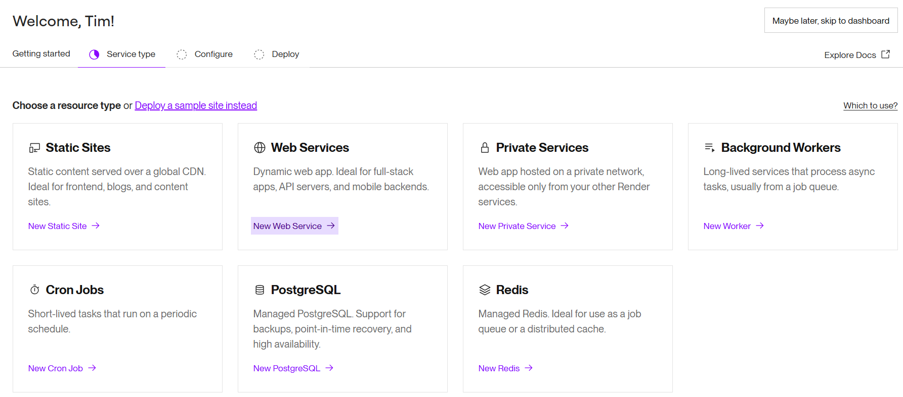
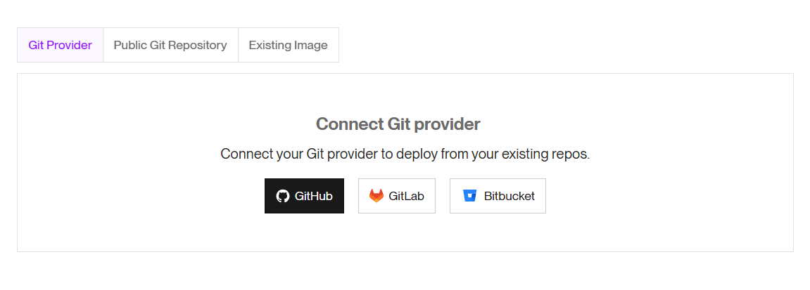
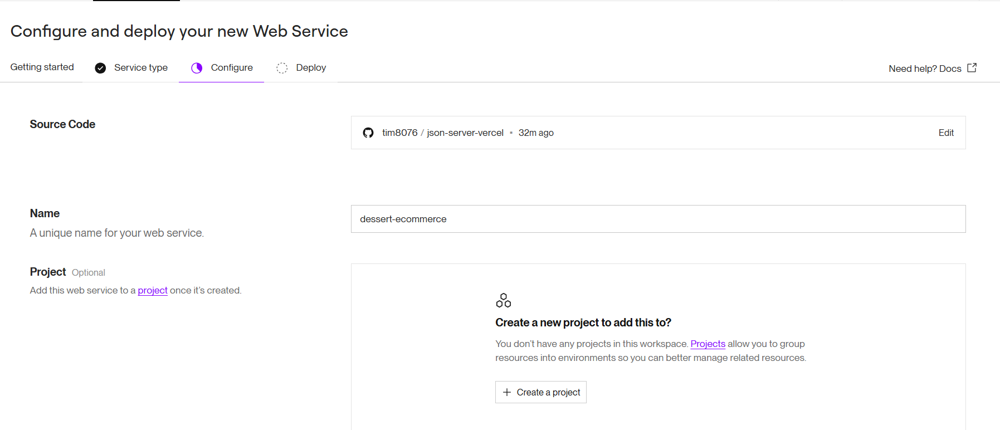
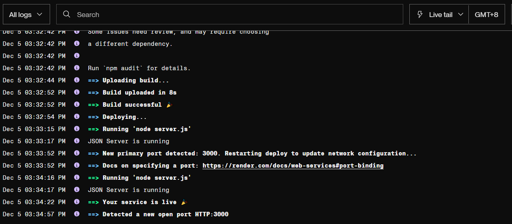

## 部署流程

1. 註冊 render 帳號

[註冊帳號](https://dashboard.render.com/)

2. Fork 範例程式碼

Fork 老師的範例到自己的帳號，修改 db.json 為自己的資料

[程式碼](https://github.com/gonsakon/json-server-vercel)

3. 建立新服務

在 [render 的控制台](https://dashboard.render.com/)，點擊 New Web Service 建立新服務

4. connect Github

點擊 connect Github

5. 設定專案訊息

- Name:專案的名字
- Region:主機位置
- Branch: 要部屬的分支，通常是 main 或 master

填完後，點 Create Web Service 按鈕

6. 部屬成功

部屬成功會出現綠色 Live