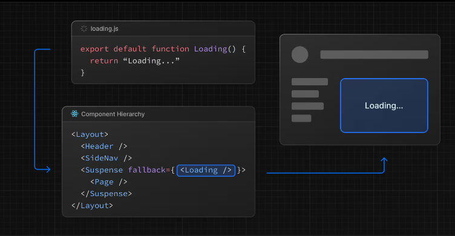

## 製作 loading 元件

可以在專案根目錄建立 `loading.jsx` 檔案，

```jsx
export default function Loading() {
  return (
    <main className="text-canter">
      <h2 className="text-primary">Loading...</h2>
      <p>Hopefully not too long</p>
    </main>
  )
}
```

這樣當其他頁面花時間有載入資料的行為時，就會呈現此 loading 元件。並且只在「路由被切換時」顯示 loading，例如從 /home 切換到 /profile。



Loading 元件會被加入 Suspense 元件內，並包住 Page 內容。 


## 搭配 suspense 元件

當只希望頁面的部分區塊呈現 loading 效果時，可以搭配 suspense 元件

```jsx

function SlowComponent() {
  // 模擬資料載入
  const data = fetchData(); // fetchData 是模擬的非同步函數
  return <div>資料載入完成：{data}</div>;
}

export default function Home() {
  return (
    <div>
      <h1>歡迎來到首頁</h1>
      <Suspense fallback={<div>載入中...</div>}>
        <SlowComponent />
      </Suspense>
    </div>
  );
}
```

如上，只有被 Suspense 包住的區塊會呈現 loading 元件 `<div>載入中...</div>`。
傳統 SSR 渲染時，後端會等全部資料都取得並渲染到 HTML 後再回傳給瀏覽器，使用 Suspense 的話，會告訴瀏覽器可以先渲染 Suspense 以外的區塊，等  Suspense 的資料取完再渲染  Suspense 區塊即可，讓使用者不用等太久。

