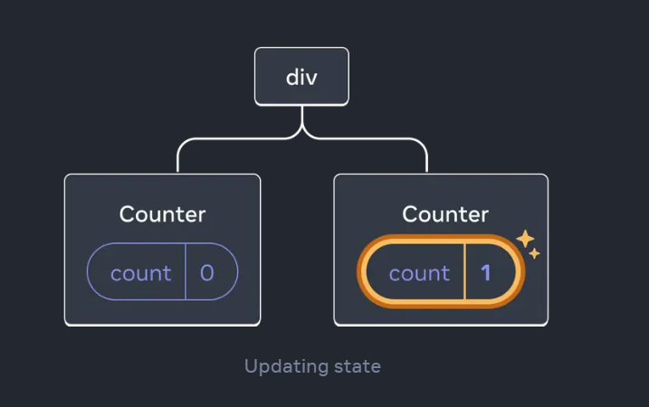
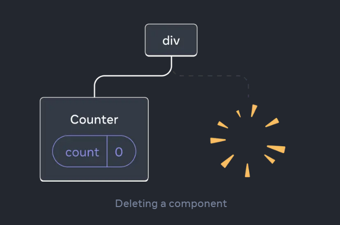
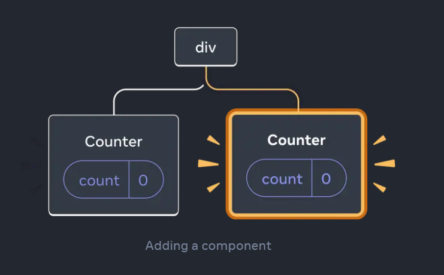
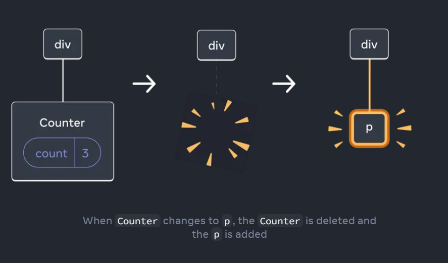
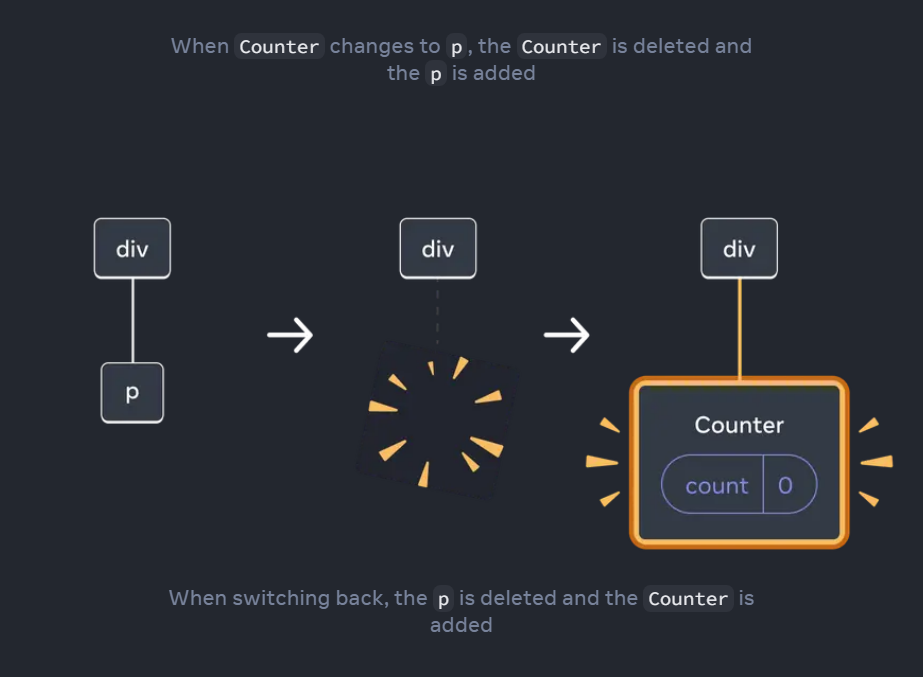

## 狀態(state)與渲染樹中的位置相關

當你給元件添加狀態時，你可能會以為這個狀態是「存在於元件內部」的。但事實上，狀態實際上是由 React 持有的。React 會根據元件在渲染樹中的位置，將它所持有的每一個狀態與對應的元件相關聯。

以下的範例中，雖然只有一個 `<Counter />` JSX 標籤，但它被渲染在兩個不同的位置：

```js
export default function App() {
  const counter = <Counter />;
  return (
    <div>
      {counter}
      {counter}
    </div>
  );
}
```

因為在 渲染樹中的位置不同，每個 counter 元件都有自己獨立的 state 與狀態。



當其中一個 counter 被刪除



又被加回來時



counter 的狀態會回到初始值。因為當一個元件被刪除，或不同的元件渲染在同個位置時，狀態就會被丟棄。

## 相同元件在相同位置

當相同元件渲染在相同位置時，狀態會被保留

```jsx
export default function App() {
  const [isFancy, setIsFancy] = useState(false);
  return (
    <div>
      {isFancy ? (
        <Counter isFancy={true} /> 
      ) : (
        <Counter isFancy={false} /> 
      )}
    </div>
  );
}
```

上面範例中，isFancy 被切換時，不管是 true 還是 false，都會在 `<div></div>` 的第一個子節點渲染 counter 這個元件，所以 counter 狀態會被保留。

## 不同元件在相同位置

當不同元件渲染在相同位置時，狀態會被丟棄

```jsx
export default function App() {
  const [isPaused, setIsPaused] = useState(false);
  return (
    <div>
      {isPaused ? (
        <p>See you later!</p> 
      ) : (
        <Counter /> 
      )}
    </div>
  );
}
```

上面範例中，當 isPaused 的值切換時，也會切換 p 跟 counter 元件的渲染，因為是不同的元件切換，狀態會丟失。





## 如何重設相同位置元件的狀態

當相同元件渲染在相同位置時，react 會將狀態會被保留。如果希望能重設狀態，有兩個方法

### 渲染在不同位置

```jsx
export default function Scoreboard() {
  const [isPlayerA, setIsPlayerA] = useState(true);
  return (
    <div>
      {isPlayerA &&
        <Counter person="Taylor" />
      }
      {!isPlayerA &&
        <Counter person="Sarah" />
      }
      <button onClick={() => {
        setIsPlayerA(!isPlayerA);
      }}>
        Next player!
      </button>
    </div>
  );
}
const [count, setCount] = useState(0);
<button onClick={() => {
}}></button>
```

### 替元件加上 key

當元件的 Key 改變時，React 會視為全新的元件，重設其狀態。

```jsx
export default function Scoreboard() {
  const [isPlayerA, setIsPlayerA] = useState(true);
  return (
    <div>
      {isPlayerA ? (
        <Counter key="Taylor" person="Taylor" />
      ) : (
        <Counter key="Sarah" person="Sarah" />
      )}
      <button onClick={() => {
        setIsPlayerA(!isPlayerA);
      }}>
        Next player!
      </button>
    </div>
  );
}
```


