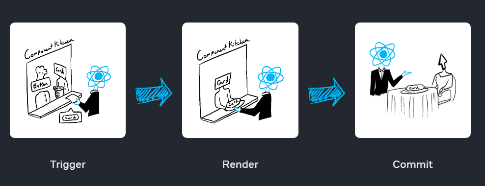

## 渲染過程

想像一下，你的元件就像廚房裡的廚師，正在用食材組合出美味的菜餚。在這個情境中，React 就是服務生，負責將顧客的需求傳達給廚房並將完成的菜餚送到顧客面前。這個請求和提供 UI 的過程包含三個步驟：

- 觸發渲染 - Triggering a render （將顧客的點餐需求送到廚房）
- 渲染元件 - Rendering the component（在廚房中準備顧客的菜餚）
- 提交到 DOM - Committing to the DOM（將菜餚端上餐桌)




## 觸發渲染( Trigger a render )

react 有兩種情形會觸發渲染

- 元件初始化時
- 元件的 state 被更新時

### 初始渲染

```js
import Image from './Image.js';
import { createRoot } from 'react-dom/client';

const root = createRoot(document.getElementById('root'))
root.render(<Image />);
```

元件第一次載入時，會呼叫 createRoot 方法，並搭配 render 方法來渲染元件

### state 更新時

當使用 set funciton 來更新元件內的 state 時，react 會重新渲染元件

## 渲染元件

當觸發渲染後，react 會呼叫該元件以決定在畫面上顯示什麼內容:

- initial render(初始渲染): 呼叫根元件
- 後續渲染: 呼叫 state 有更新的元件。

這個過程是遞歸的：如果被更新的元件返回了其他元件，React 會接著渲染那個元件；如果該元件又返回了其他東西，React 會繼續渲染。這個過程會一直進行，直到沒有更多嵌套的元件，React 才能確定螢幕上應該顯示的內容。
在以下範例中，React 會多次調用 Gallery() 和 Image()：

```jsx
export default function Gallery() {
  return (
    <section>
      <h1>Inspiring Sculptures</h1>
      <Image />
      <Image />
      <Image />
    </section>
  );
}
```

當 Gallery() 被渲染時，React 將執行 Gallery() 函式，生成該元件的 JSX 樹。
遇到 `<Image />` 元件標籤，React 會依次調用 Image() 函式進行渲染。

## 提交到 DOM(commits changes to the DOM )

在渲染（調用）你的元件之後，React 將修改 DOM。

- 初始渲染時，React 會使用 appendChild() DOM API，將它創建的所有 DOM 節點放到螢幕上。
- 重新渲染時，React 會執行最少量的必要操作（在渲染過程中計算得出！），以使 DOM 與最新的渲染輸出一致。

React 只有在渲染之間出現差異時才會改變 DOM 節點。例如，以下是一個元件，它每秒從父元件接收不同的 props 並重新渲染。

```jsx
export default function Clock({ time }) {
  return (
    <>
      <h1>{time}</h1>
      <input />
    </>
  );
}
```

當 time 更新時，ract 只會重新渲染 h1 的內容，input 則保持原樣