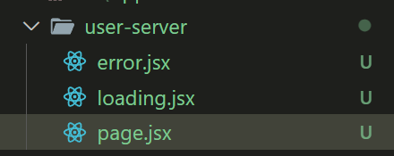

## SSR 元件 (Server-Side Rendering)

*是指在伺服器上預先處理並生成 HTML，然後將完整的 HTML 發送到用戶端。
在 ssr 元件中取得遠端資料方法，直接將元件轉為 async function ，在內部使用 fetch 取的資料，並用 await 等待資料。

```js
const { API, API_PATH } = process.env;
export default async function Products() {
  const res = await fetch(`${API}/v2/api/${API_PATH}/products/all`);
  const json = await res.json();
  const data = json.products;
  return (
    <>
      <div>
        產品列表
      </div>
      { data.map(product => {
        return (
          <div key={product.id}>
            <Link href={`/products/${product.id}`}>
              { product.title }
            </Link>
          </div>
        )
      })}
    </>   
  )
}
```



在 server 元件中處理 loading 和 error 的方法是分別在資料夾內加入 loading.jsx 和 error.jsx

## CSR 元件

在 CSR 元件中取得遠端資料的方法和一般在寫 REACT 時一樣，在 useEffect 內發出ajax 取得資料即可。

```jsx
export default function UserClient() {
  const [users, setUsers] = useState({});
  const [loading, setLoading] = useState(true);
  const [error, setError] = useState('');
  useEffect(() => {
    async function fetchUser() {
      try {
        const res = await fetch('https://jsonplaceholder.typicode.com/users');
        if (!res.ok) throw new Error('Fail to fetch users')
        const data = await res.json();
        setUsers(data);
      } catch(err) {
        if (err instanceof Error) {
          setError(err.message)
        } else {
          setError('An UnKnown Error')
        }
      } finally {
        setLoading(false);
      }
    }
    fetchUser();
  }, []);

  if (loading) return <div>Loading...</div>
  if (error) return <div>{ error }</div>
  return (
    <ul className="space-y-4 p-4">
      { users.map(user => {
        return (
          <li key={user.id}
            className="p-4 bg-white shadow-md rounded-lg text-gray-700">
            <p className="font-bold">{user.name}</p>
            <div className="text-sm">
              <p>UserName: {user.username}</p>
              <p>Email: {user.email}</p>
              <p>Phone: {user.phone}</p>
            </div>
          </li>
        )
      })}
    </ul>
  )
}
```

## 資料依序取得 (Sequential Fetching)

Sequential Fetching 指的是資料按順序取得，比如先取得貼文資料，在依照每筆貼文的使用者 id 去取得使用者資料。

```jsx
export default async function page() {
  const res = await fetch('https://jsonplaceholder.typicode.com/posts');
  const posts = await res.json();
  const filteredPosts = posts.filter(post => post.id % 10 === 1)
  return (
    <div className="p-4 max-w-7xl mx-auto">
      <h1 className="text-3xl font-bold mb-8">Blog Posts</h1>
      <div className="grid grid-cols-1 md:grid-cols-2 gap-8">
        { filteredPosts.map(post =>(
          <div key={post.id} className="bg-white shadow-md rounded-lg p-5">
            <h2 className="text-2xl font-bold mb-3 text-gray-800">
              { post.title }
            </h2>
            <p className="text-gray-600 mb-4">
              { post.body }
            </p>
            <Suspense fallback={<div>Loading authors</div> }>
              <Author userId={post.userId}/>
            </Suspense>
          </div>
        ))}
      </div>
    </div>
  )
}
```

```jsx
// Author.jsx
export default async function Author({ userId }) {
  const res = await fetch(`https://jsonplaceholder.typicode.com/users/${userId}`)
  const user = await res.json();
  return (
    <div className='text-sm text-gray-500'>
      Written by:
      <span className='font-semibold text-gray-700 hover:text-gray-700'>
        { user.name }
      </span>
    </div>
  )
}
```

上面範例中，會先取得 posts 資料後， Author 元件內在依照傳入的 userId 取得 user 資料。

## 資料同時取得

如果頁面中有不相關的兩筆資料，可以用同時取得的方式減少等待時間。下面範例中使用 Promise.all 同時取得 post 和 album 資料。

```jsx
export async function getUsersPosts(userId) {
  const res = await fetch(`https://jsonplaceholder.typicode.com/posts?userId=${userId}`);
  return res.json();
}

export async function getUsersAlbums(userId) {
  const res = await fetch(`https://jsonplaceholder.typicode.com/albums?userId=${userId}`);
  return res.json();
}
export default async function page({ params }) {
  const { id } = await params;
  const postsData = getUsersPosts(id);
  const albumsData = getUsersAlbums(id);
  const [posts, albums] = await Promise.all([postsData, albumsData]);

  return (
    <div className="p-4 max-w-7xl mx-auto">
      <h1 className="text-3xl font-extrabold mb-8">User Profile</h1>
      <div className="grid grid-cols-1 md:grid-cols-2 gap-8">
        <div>
          <h2 className="text-2xl font-bold mb-4">Posts</h2>
          <div className="space-y-4">
            {posts.map((post) => (
              <div key={post.id} className="bg-white shadow-md rounded-lg p-6">
                <h3 className="text-lg font-bold mb-3 text-gray-800 leading-tight">
                  {post.title}
                </h3>
                <p className="text-gray-600 mb-4 leading-relaxed">
                  {post.body}
                </p>
              </div>
            ))}
          </div>
        </div>
        <div>
          <h2 className="text-2xl font-bold mb-4">Albums</h2>
          <div className="space-y-4">
            {albums.map((album) => (
              <div key={album.id} className="bg-white shadow-md rounded-lg p-6">
                <p className="text-gray-700">{album.title}</p>
              </div>
            ))}
          </div>
        </div>
      </div>
    </div>
  )
}

```

