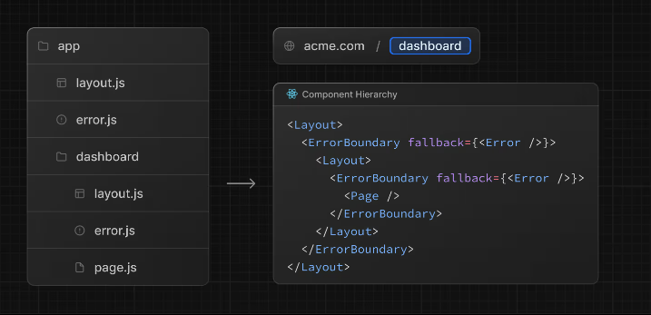

## 錯誤類型

Next.js 將錯誤分為兩大類：

1. 預期錯誤（Expected errors）：例如表單驗證、API 呼叫失敗，可預見的錯誤，建議另外處理並回傳結果。

2. 未捕獲例外（Uncaught exceptions）：例如程式 bug 或意外例外，需透過 error boundary 或 global error UI 處理。

## 處理預期錯誤 

「預期錯誤」（例如：表單沒填、權限不足、資料不存在等）不要直接丟錯（throw）。
而是用 return { message: '錯誤內容' } 這種方式，讓前端接收到錯誤後去顯示，不會讓整個頁面崩潰。


### Server Functions

在 Server Functions 中處理預期錯誤時，避免使用 try catch 去直接丟錯，而是用 return { message: '錯誤內容' } 這種方式，讓前端接收到錯誤後去顯示。

```js
'use server'
export async function createPost(_, formData) {
  const title = formData.get('title');
  if (!title) {
    return { message: '標題不能空白' }; // 預期錯誤回傳
  }
  // 正常寫入資料流程...
}
```

在 Client Component 中可以用 useActionState，接收 action 返回的 state，並呈現錯誤訊息給使用者。

```js
'use client'
import { useActionState } from 'react'
import { createPost } from '@/app/actions'

function Form() {
  const [state, formAction, pending] = useActionState(createPost, { message: '' });
  return (
    <form action={formAction}>
      {/* 表單欄位 */}
      {state?.message && <p>{state.message}</p>}
      <button disabled={pending}>Create</button>
    </form>
  );
}
```

在 Server Components 中可以用回傳的結果決定顯示的畫面

```js
export default async function Page() {
  const res = await fetch(`https://...`)
  const data = await res.json()
  if (!res.ok) {
    return 'There was an error.'
  }
 
  return '...'
}
```

## 處理預期外的錯誤

未捕獲例外（Uncaught exceptions）：例如程式 bug 或意外例外，需透過 error boundary 或 global error UI 處理。

在路由資料夾內新增 `error.js`，error.js 必須為 Client Components

```js
'use client' // Error boundaries must be Client Components
import { useEffect } from 'react'

export default function Error({ error, reset }) {
  useEffect(() => {
    // Log the error to an error reporting service
    console.error(error)
  }, [error])
 
  return (
    <div>
      <h2>Something went wrong!</h2>
      <button
        onClick={
          // Attempt to recover by trying to re-render the segment
          () => reset()
        }
      >
        Try again
      </button>
    </div>
  )
}
```



## 全域錯誤

global-error.js 是整個 Next.js App Router 架構中的最終防線，來處理那些「無法被 route segment 的 error.js 捕捉的錯誤」，會加在專案根目錄，且要是 Client Components。

global-error.js 必須包含 html、body。

```js
// app/global-error.js
'use client' // Error boundaries must be Client Components
 
export default function GlobalError({ error, reset }) {
  return (
    // global-error must include html and body tags
    <html>
      <body>
        <h2>Something went wrong!</h2>
        <button onClick={() => reset()}>Try again</button>
      </body>
    </html>
  )
}
```
