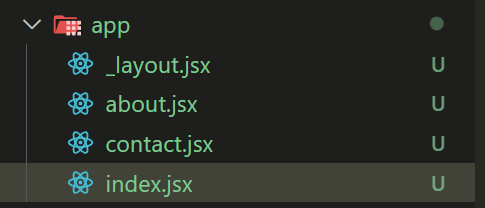

## 加入 layout

layout 是每一頁都會出現的版型，如 Header、Footer，在 React native 中加入 layout 可以在 app 資料夾中加入 _layout.jsx



```jsx
import { StyleSheet, Text, View } from 'react-native'
import { Slot } from 'expo-router'

const RootLayout = () => {
  return (
    <View style={{ flex: 1 }}>
      <Slot />
      <Text>Footer</Text>
    </View>
  )
}

export default RootLayout
const styles = StyleSheet.create({})
```

在 jsx 中加入 Slot 元件，Slot 是用來告訴 React native 每一頁的內容要渲染在哪，其餘則為共同版型。


## Stack

Stack 元件功能和 Slot 一樣，只是會在最上方自動加入導航的導覽列，能回到上一頁

```jsx
import { Stack } from 'expo-router'
const RootLayout = () => {
  return (
    <View style={{ flex: 1 }}>
      <Stack />
      <Text>Footer</Text>
    </View>
  )
}
```


```jsx
const RootLayout = () => {
  return (
    <Stack screenOptions={{
      headerStyle: { backgroundColor: '#ddd' }, // Stack 背景色
      headerTintColor: '#333', // Stack 文字顏色
    }}>
      <Stack.Screen name="index" options={{ title: 'Home' }}/>
      <Stack.Screen name="about" options={{ title: 'About' }}/>
      <Stack.Screen name="contact" options={{ title: 'Contact', headerShown: false }}/>
    </Stack>
  )
}
```
Stack 詳細設定方式

- Stack.Screen: 設定每一頁面，name 代表路由， options 內的 title 為Stack 顯示名稱。
- Stack screenOptions: 最外層的 screenOptions 可以統一設定所有 Stack 內容，如背景色、文字顏色等