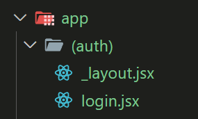

## 加入路由

安裝 [Expo Router](https://docs.expo.dev/router/installation/#manual-installation)

```
npx expo install expo-router react-native-safe-area-context react-native-screens expo-linking expo-constants expo-status-bar
```

修改 package.json，將 main 的值改為以下

```json
{
  "main": "expo-router/entry"
}
```

在 app.json 中加入 scheme，scheme 是一種讓你的 app 能夠透過特定協議開啟的方式（像網址開頭的 https://、mailto:，但是你自訂的），稱為「URL Scheme。

```json
{
  "scheme": "shelfie-app",
}
```

比如修改成 shelfie-app，就可以用 shelfie-app:// 來開啟 app。

## 加入新頁面

Expo-router 是採用檔案路徑做為路由，如下圖


元件與對應路由為

- index: /
- about: /about
- contact: /contact


## 加入 Link 元件

可以在頁面中加入 Link 原件來切換頁面，功能就相當於網頁的 a 連結

```js
import { Link } from 'expo-router'

const Home = () => {
  return (
    <View style={styles.container}>
      <Link href="/about" style={styles.link}>
        About page
      </Link>
      <Link href="/contact" style={styles.link}>
        Contact page
      </Link>
    </View>
  )
}
```

## 群組路由



如果不希望資料夾名稱變成路由路徑時，用 () 包住資料夾名稱，此時此資料夾就不會成為路由的一部分。
如上圖 login.jsx 對應的路由是 /login
