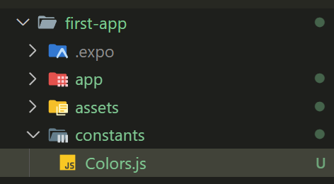

## 暗色主題設定

```json
"userInterfaceStyle": "light",
```

在專案 app.json 中可以看到主題色預設為亮色(light)，我們可以改為 dark。

## 新增 Colors.js

在專案根目錄 新增 Colors.js，裡面有 亮色和暗色色碼



```js
export const Colors = {
  primary: "#6849a7",
  warning: "#cc475a",
  
  dark: {
    text: "#d4d4d4",
    title: "#fff",
    background: "#252231",
    navBackground: "#201e2b",
    iconColor: "#9591a5",
    iconColorFocused: "#fff",
    uiBackground: "#2f2b3d",
  },
  light: {
    text: "#625f72",
    title: "#201e2b",
    background: "#e0dfe8",
    navBackground: "#e8e7ef",
    iconColor: "#686477",
    iconColorFocused: "#201e2b",
    uiBackground: "#d6d5e1",
  },
}
```

## 使用亮色或暗色模組

```jsx
const RootLayout = () => {
  const colorScheme = useColorScheme();
  const theme = Colors[colorScheme] ?? Colors.light;
  return (
    <>
      <StatusBar value="auto"/>
      <Stack screenOptions={{
        headerStyle: { backgroundColor: theme.navBackground },
        headerTintColor: theme.title,
      }}>
        <Stack.Screen name="index" options={{ title: 'Home' }}/>
        <Stack.Screen name="about" options={{ title: 'About' }}/>
        <Stack.Screen name="contact" options={{ title: 'Contact', headerShown: false }}/>
      </Stack>
    </>
  )
}
```

元件中呼叫 useColorScheme 方法，會回傳目前 "userInterfaceStyle" 是 'dark' 還是 'light'。
透過 `Colors[colorScheme]` 即可取回當前顏色物件，之後在 jsx 中套用 theme 顏色即可。
