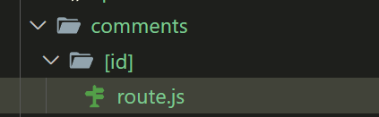

## 簡介

Route Handler 顧名思義，我們可以將路由定義成 API endpoint，來處理 HTTP request 和 response。

## 創建 route handler 

我們只需要在 /app 中的資料夾，建一個 route.ts/js 即可，路由定義的模式跟 page.tsx 相同，也可以使用巢狀、動態路由。

舉例來說，app/api/products/route.js 即會對應 /api/products 這支 API；app/new_api/profile/route.ts 即會對應 /new_api/profile 這支 API。

Route handler 支援 GET、POST、PUT、PATCH、DELETE、HEAD、OPTIONS 七種 HTTP methods

要使用哪個 method，就以該 method 當作 export function 的名稱。比方說：

```js
/* app/api/hello/route.ts */
export function GET() {
  return Response.json({ message: 'Hello World!' });
}


export function POST(){
…
}
```

這時候打 http://localhost:3000/api/hello 這支 API ( GET )，就可以得到

```json
{
  "message": "Hello World!"
}
```

## GET Requests

```js
// data.js
export const comments = [
  {
    id: 1,
    text: 'This is first comment',
  },
  {
    id: 2,
    text: 'This is second comment',
  },
  {
    id: 3,
    text: 'This is third comment',
  },
]
```
```js
// app/comments/route.js
import { comments } from "./data";

export async function GET() {
  return Response.json(comments);
}
```
api: http://localhost:3000/comments

上面範例中是 get 請求，使用 Response.json 回傳 comments 資料。

## POST Requests

api: http://localhost:3000/comments

```js
// app/comments/route.js

export async function POST(request) {
  const comment = await request.json();
  const newComment = {
    id: comments.length + 1,
    text: comment.text,
  }
  comments.push(newComment);
  return new Response(JSON.stringify(newComment), {
    headers: { "Content-Types": "application/json" },
    status: 201,
  })
}
```

上面範例中先用 request.json() 解析傳入的 body 物件成 js 格式

```json
// body 物件
{
  "text":"new comments"
}
```

資料寫入資料庫後再用，new Response 回傳結果。

## 動態路由

前面介紹的 api: http://localhost:3000/comments 是取得全部資料，若要取得單一資料的 api 為 http://localhost:3000/comments/1

如上可以取得 comments 裡 id 為 1 資料

- 路由建立



在 comments 資料夾內建立 [id] 資料夾，裡面再建立 route.js 就是動態路由建立方式

```js
// app/comments/[id]/route.js
import { comments } from "../data";

export async function GET(_request, { params }) {
  const { id } = await params;
  const comment = comments.find(comment => comment.id === parseInt(id));
  return Response.json(comment)
}
```

可以從 GET function 中的第二個參數取得 id 的值。

## PATCH Requests

api: http://localhost:3000/comments/1

PATCH 方法用來修改單一物件的值

```js
export async function PATCH(request, { params }) {
  const { id } = await params;
  const body = await request.json();
  const { text } = body;
  const index = comments.findIndex(comment => comment.id === parseInt(id));
  comments[index - 1].text = text;
  return Response.json(comments[index])
}
```

在 PATCH 函式中 request 可以取得 body 的值，params 則可以取得路由參數。

## Delete Requests

api: http://localhost:3000/comments/1

PATCH 方法用來刪除單一資料

```js

export async function DELETE(request, { params }) {
  const { id } = await params;
  const index = comments.findIndex(comment => comment.id === parseInt(id));
  const deleteComment = comments[index];
  comments.splice(index, 1);
  return Response.json(deleteComment)
}
```

在 PATCH 函式中 params 則可以取得路由參數。

## Query 參數

api: http://localhost:3000/comments?query=first

如果想在 api 中加入query 參數可以這樣做

```js
export async function GET(request) {
  const searchParams = request.nextUrl.searchParams;
  const query = searchParams.get('query');
  const filteredComments = query ? comments.filter(comment => comment.text.includes(query)): comments;
  return Response.json(filteredComments);
}
```

在 request.nextUrl 取得 searchParams，再用 searchParams.get() 取得 query 參數的值。
取得參數值之後再去過濾資料即可。


## Headers

在 Next.js 13+ (App Router) 的 Route Handlers 裡，headers 是一個可以用來：

- 讀取 Request Headers（請求頭）
- 設定 Response Headers（回應頭）

它對應到瀏覽器或 API 請求裡的 HTTP header，常用來傳遞像：
- 認證資訊（Authorization）
- 內容格式（Content-Type）
- 語系（Accept-Language）
- Cache 控制（Cache-Control）

### 讀取請求的 Headers

你可以在 Route Handler（例如 app/api/xxx/route.js）裡這樣寫：

```js
import { headers } from 'next/headers';

export async function GET() {
  const requestHeaders = headers();
  const token = requestHeaders.get('authorization');

  return new Response(JSON.stringify({ token }), {
    headers: { 'Content-Type': 'application/json' }
  });
}
```

- headers() 回傳一個 Headers 物件（類似 Fetch API 的 Headers）
- .get('header-name') 可以讀取指定的 header 值（名稱不分大小寫)

### 設定回應的 Headers

```js
export async function GET() {
  return new Response('Hello', {
    headers: {
      'Content-Type': 'text/plain',
      'Cache-Control': 'no-store'
    }
  });
}
```

這樣客戶端收到的 Response 就會帶上你設定的 HTTP headers。

## Cookies

在 Next.js App Router 中，你可以在 Route Handlers（例如 app/api/.../route.js）裡使用 next/headers 提供的 cookies() API 來 讀取 和 設定 Cookie。

### 讀取 Cookie

```js
import { cookies } from 'next/headers';

export async function GET() {
  const cookieStore = cookies();
  const token = cookieStore.get('token'); // 取得名為 "token" 的 cookie

  return new Response(`Token: ${token?.value || '無 token'}`);
}
```
- cookies() 回傳一個 RequestCookies 物件
- .get(name) 會回傳 { name, value } 物件，如果沒有會是 undefined
- .getAll() 可以取得所有 Cookie

### 設定 Cookie

```js
import { cookies } from 'next/headers';

export async function GET() {
  const cookieStore = cookies();

  cookieStore.set('token', 'abc123', {
    httpOnly: true, // 防止 JS 讀取
    secure: true,   // 只在 HTTPS 下傳送
    path: '/',      // Cookie 作用範圍
    maxAge: 60 * 60 // 秒數：1 小時
  });

  return new Response('Cookie 已設定');
}
```
- 這個 .set() 只能在 Route Handler 或 Server Action 裡用
- 直接在 Client Component 裡調用會報錯（因為它是 Server API）

### 刪除 Cookie

```js
import { cookies } from 'next/headers';

export async function GET() {
  const cookieStore = cookies();
  cookieStore.delete('token');

  return new Response('Cookie 已刪除');
}
```

## Redirects

如果你要在 Route Handler（例如 app/api/.../route.js）中進行導向（Redirect），可以使用 next/navigation 提供的 redirect() 函式。

```js
import { redirect } from 'next/navigation';
import { cookies } from 'next/headers';

export async function GET() {
  const cookieStore = cookies();
  const token = cookieStore.get('token');

  if (!token) {
    // 沒有登入 token，導向到登入頁
    redirect('/login');
  }
  return new Response('已登入，可以看到的內容');
}
```

- redirect() 會直接結束函式並回傳一個 3xx 回應
- 適合處理登入檢查、資源移動等情境
- 只能在 Server Component、Route Handlers、或 Server Actions 裡用
- 在 Route Handlers 中使用時，它是透過拋出一個特殊錯誤讓 Next.js 處理

## Catching

在 route handler 中的 GET 方法取回的資料如果不會變動，可以採用 catching 模式，指的是 Next.js 會快取 fetch 的結果，之後請求會直接回傳快取的資料，不會重複執行 function

- 有catching: 每次請求都拿到一樣快取的資料
- 沒catching: 每次請求都重新執行 handler

在 route.js 中加入 'force-static'，即可啟動快取功能

```js
// app/api/products/route.js
export const dynamic = 'force-static'

export async function GET() {
  const res = await fetch('https://api.example.com/products', {
    cache: 'force-cache' // 也可以在 fetch 層級控制
  })
  const data = await res.json()

  return Response.json(data)
}
```


