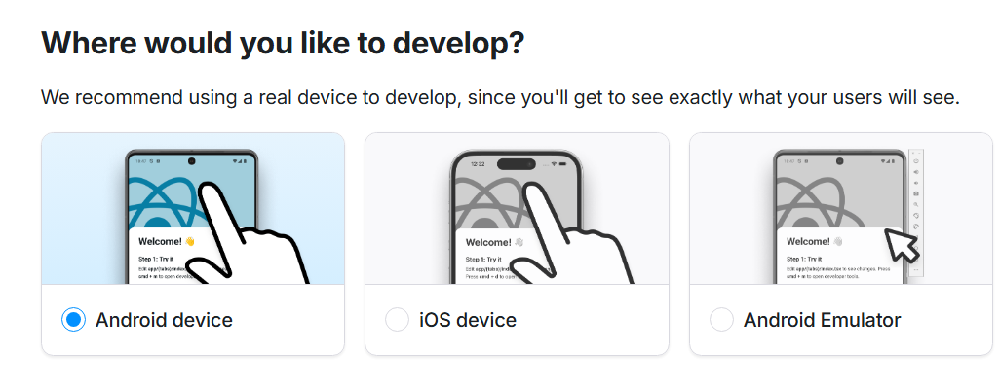
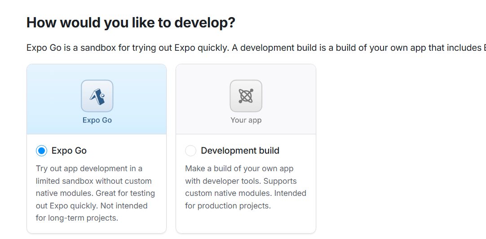
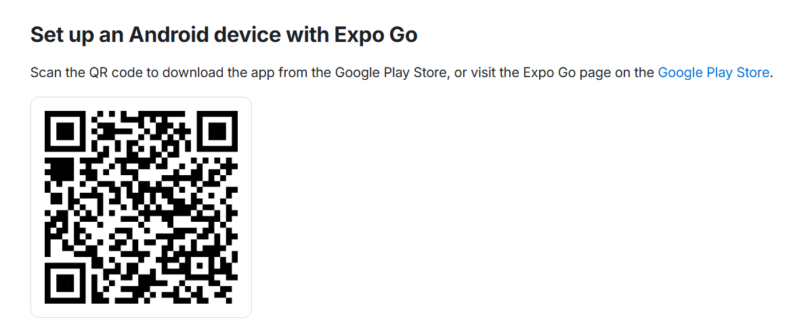
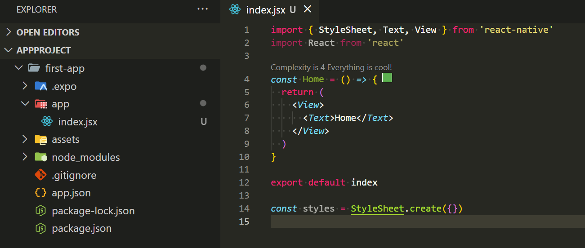

## 建立專案

會推薦使用 [Expo](https://docs.expo.dev/) 框架來建立 react-native 專案:

```
npx create-expo-app@latest --template blank
```

上面 --template 是可選模板，可參考[這裡](https://docs.expo.dev/more/create-expo/#--template)

## 設定開發環境

1. 到 [Expo官網](https://docs.expo.dev/get-started/set-up-your-environment/?platform=android&device=physical) 設定開發環境，手邊的手機是 Android 就選 Android，是 iphone 就選 ios。



2. 選擇開發工具 (推薦使用 Expo Go)



3. 下載 Expo Go



手機掃描 QRcode 下載 Expo Go

4. 在專案中終端機輸入下面指令來開啟開發伺服器

```
npx expo start
```

5. 掃描 QR code

使用手機 Expo Go 程式，掃描終端機中產生的 QRcode，要確保手機跟電腦的網路在同一個 ip 位置下。

6. 確認畫面

在 Expo Go 就可看到專案畫面。

## 檔案調整

在 Expo Go 會使用 Expo Router 來建立路由，所以先可以刪除根目錄的 index.js 和 App.js，並在根目錄建立 App 資料夾，並在資料夾內建立 index.jsx (首頁)




